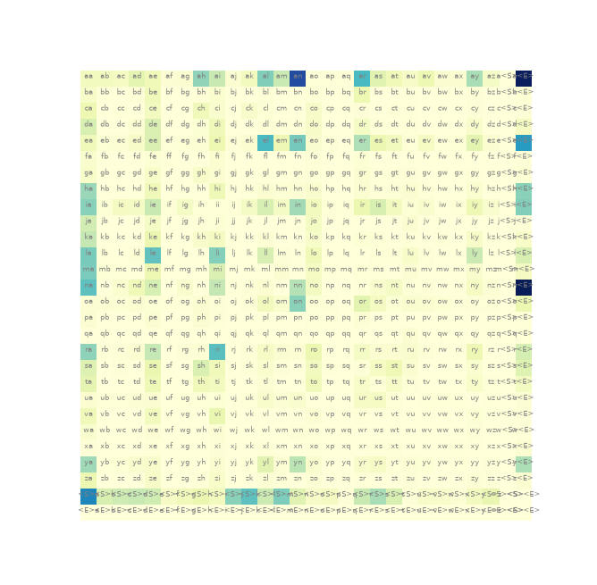
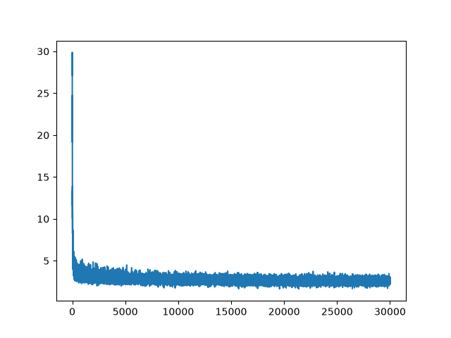
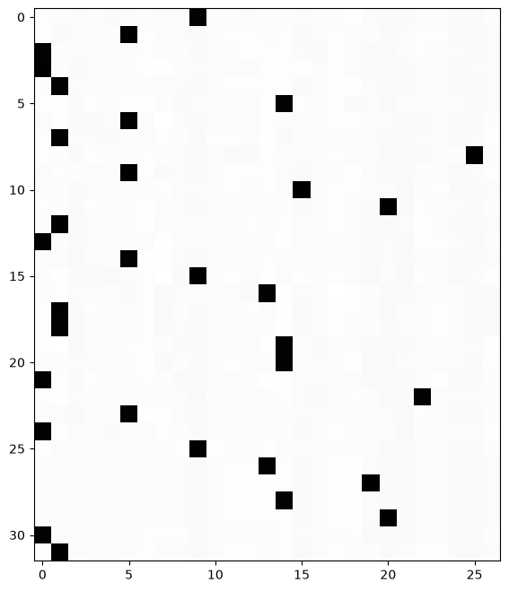
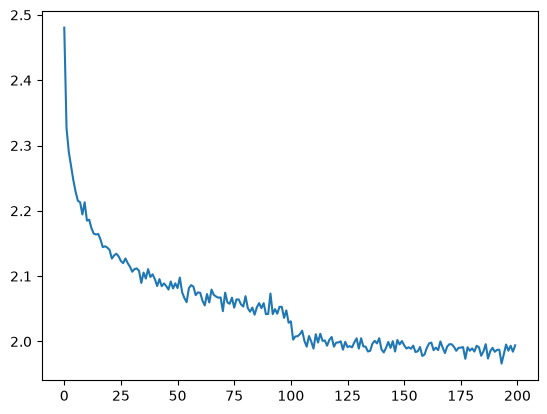

# makemany

A staged implementation of a character-level language model trained on the names in [`names.txt`](names.txt), inspired by Andrej Karpathy's [makemore](https://github.com/karpathy/makemore). 

I organized it into five increasingly complex experiments: a bigram language model, a multilayer perceptron (MLP), batch normalization, manual backpropagation, and a custom layered model with a WaveNet-style structure.

I use the project to study how a next-character predictor can be built and inspected from first principles. I represent each name as a sequence of characters. The model receives a context and predicts the next character, including a special `.` symbol that I use for both the beginning and end of a name.



## Abstract

I start with a 27-by-27 probability table and end with a manually assembled neural network. My early baseline estimates character transitions directly from counts. The later models learn character embeddings and nonlinear transformations using cross-entropy loss and mini-batch gradient descent. In the notebooks, I expose intermediate mechanisms such as batch normalization statistics, gradient calculations, parameter shapes, and generated names.

I favor explicit tensor operations over framework abstractions in order to grasp the more granular aspects of language modeling. In the 3rd and 5th notebooks, I transition away from this, defining a PyTorch-style API with `Linear`, `BatchNorm1d`, `Tanh`, `Embedding`, `FlattenConsecutive`, and `Sequential` components, then train a model composed from those layers.

## Repository structure

| File | Role |
| --- | --- |
| [`names.txt`](names.txt) | Name data used by nearly every experiment. |
| [`1_bigram.py`](1_bigram.py) | Count-based and neural bigram models. |
| [`2_mlp.py`](2_mlp.py) | Character-embedding MLP with a three-character context. |
| [`3_batch_norm.ipynb`](3_batch_norm.ipynb) | MLP extended with batch normalization and running statistics. |
| [`4_manual_backprop.ipynb`](4_manual_backprop.ipynb) | Explicit forward and backward calculations, followed by manual training. |
| [`5_rnn.ipynb`](5_rnn.ipynb) | Custom layer API and a hierarchical, WaveNet-style model. |
| [`backfeed.txt`](backfeed.txt) | Generated names written by the part 3 notebook. |
| [`requirements.txt`](requirements.txt) | Python package requirements. |

## Methods

### Data representation

I derive the vocabulary from the characters present in `names.txt`, then assign index `0` to `.` and indices `1` through `26` to the sorted characters. 

I convert names into input-target pairs by appending `.` to each name. In the MLP-based experiments, I shift a context of three character indices across each name to predict one target character at a time.

The MLP notebooks shuffle the names with seed `42` and split them approximately into 80% training, 10% development, and 10% test data. My evaluation cells use the training and development sets; I construct the test tensors but do not evaluate them in the visible notebook code.

### Architecture (at a glance)

| Stage | Input representation | Main transformation | Training mechanism |
| --- | --- | --- | --- |
| 1. Bigram | One character index | 27-by-27 transition probabilities | Counts, then direct weight optimization |
| 2. MLP | Three character indices | Embedding, concatenation, `tanh`, output logits | PyTorch autograd |
| 3. Batch normalization | Same three-character context | MLP with normalized hidden preactivations | PyTorch autograd and running statistics |
| 4. Manual backpropagation | Same three-character context | Same normalized MLP, with explicit derivatives | Hand-written gradients |
| 5. Custom layered model | Three character indices | Progressive flattening and repeated nonlinear blocks | Custom `Sequential.fit` loop |

### Stage 1: Bigram baseline

**Architecture**

```text
previous character -> 27-way transition row -> next character
```

In [`1_bigram.py`](1_bigram.py), I count adjacent character pairs in a 27-by-27 tensor. Each row represents the previous character and each column represents the next character. I apply add-one smoothing, normalize each row, and sample the next character from that row. The special `.` row starts a name, and sampling stops when `.` is produced.

I then express the same bigram relationship as a small neural model:

```text
one-hot character (27) -> weight matrix (27 x 27) -> logits -> probabilities
```

I optimize this weight matrix with mean negative log likelihood for 100 iterations. This gives me a direct comparison between a count-based transition table and a learned parameter matrix with the same input and output structure.


### Stage 2: Character-embedding MLP

**Architecture**

```text
3 character indices
	|
27 x 10 embedding table
	|
concatenate embeddings (30)
	|
linear layer (30 -> 200) + tanh
	|
linear layer (200 -> 27)
	|
next-character logits
```

In [`2_mlp.py`](2_mlp.py), I replace the single-character input with a rolling context of three characters. The embedding table gives each of the 27 symbols a 10-dimensional representation. I concatenate the three vectors, apply a 200-neuron `tanh` hidden layer, and project the result to 27 output logits.

I train with mini-batches of 32 for 50,000 steps using cross-entropy loss and a learning rate of `0.1`. I then evaluate the development loss and sample 20 names by repeatedly shifting the context and drawing from the output softmax.



### Stage 3: MLP with batch normalization

**Architecture**

```text
3 character indices -> embeddings (30) -> linear (30 -> 200)
				      -> batch normalization
				      -> tanh
				      -> linear (200 -> 27)
				      -> next-character logits
```

In [`3_batch_norm.ipynb`](3_batch_norm.ipynb), I keep the data representation and MLP dimensions from stage 2. I normalize the hidden preactivations across each mini-batch, then apply a learned gain and bias before `tanh`. During training, I update running means and standard deviations; after training, I use those running values for evaluation and generation.

I train for 200,000 steps with batches of 32 and a learning rate of `0.01`. The notebook records loss values, calibrates the normalization statistics, evaluates the training and development losses, and samples names.

### Stage 4: Manual backpropagation

**Architecture**

Stage 4 uses the same forward architecture as stage 3. The change is in how I calculate the gradients:

```text
embedding -> linear -> batch normalization -> tanh -> linear -> cross-entropy
     ^          ^              ^               ^       ^
     |          |              |               |       |
     +----------+--------------+---------------+-------+
		 explicit backward pass
```

In [`4_manual_backprop.ipynb`](4_manual_backprop.ipynb), I first calculate cross-entropy and batch-normalization operations both explicitly and with PyTorch. I compare each manually derived gradient with the gradient retained from PyTorch to check the implementation. I then train using explicit derivatives for the logits, `tanh`, batch normalization, linear layers, embeddings, and character lookup table.

The final training loop does not call `Tensor.backward()`. After the manual updates, I sample five names from the model.



### Stage 5: Custom layered model

**Architecture**

```text
embedding (27 -> 10)
	|
flatten consecutive pairs -> linear -> batch norm -> tanh
	|
flatten consecutive pairs -> linear -> batch norm -> tanh
	|
flatten consecutive pairs -> linear -> batch norm -> tanh
	|
linear -> 27 next-character logits
```

In [`5_rnn.ipynb`](5_rnn.ipynb), I implement a small PyTorch-like layer system with `Embedding`, `FlattenConsecutive`, `Linear`, `BatchNorm1d`, `Tanh`, and `Sequential`. `FlattenConsecutive` progressively combines neighboring representations instead of flattening the full context at once. The three repeated blocks therefore build a hierarchical receptive field before the final projection.

The model uses 10-dimensional embeddings, 68 hidden units, and a final 27-way output layer. My `Sequential.fit` method samples mini-batches, runs the forward pass, computes cross-entropy, clears gradients, calls the existing tensor backward mechanism, updates parameters, and records loss. It also lowers the learning rate after half of the requested training steps.



## Objective and Sampling

Across the neural experiments, I optimize cross-entropy loss over the next-character targets. During generation, I start with a context of three `.` symbols, sample from the output softmax, shift the context, and stop when the sampled index is `0`. I use explicitly seeded PyTorch generators in the scripts and notebooks, although model initialization and execution details differ between parts.

## Setup

From the repository root, create and activate a Python environment, then install the pinned requirements:

```text
python -m venv .venv
```

On Windows PowerShell:

```text
.\.venv\Scripts\Activate.ps1
python -m pip install -r requirements.txt
```

I do not define a separate command-line entry point. You can run the first two experiments from the repository root so their relative read of `names.txt` resolves correctly:

```text
python 1_bigram.py
python 2_mlp.py
```

You can then open the three `.ipynb` files in Jupyter or VS Code and execute their cells in order. The notebooks also expect the repository root to be the working directory because they read `names.txt` using a relative path. 

Part 3 writes generated output to `backfeed.txt` in one of its final cells so I can experiment with training the model on its own output.

## Reproducibility Notes

I use fixed seeds in several places, including `42` for shuffling the MLP dataset and `2147483647`-based seeds for PyTorch generators. Actual results, even when using the same seeds as me, may differ slightly.

## Scope

I present this as an educational implementation rather than a packaged training library. The experiments share data-preparation conventions but retain separate, exploratory code paths. In particular, I construct a test split in the notebooks, but the visible evaluation cells report training and development losses only. I include no saved model checkpoints or command-line configuration interface.

## References

[1] Y. Bengio et al., “A Neural Probabilistic Language Model,” Journal of Machine Learning Research, vol. 3, pp. 1137–1155, 2003, Accessed: Aug. 23, 2026. [Online]. Available: https://www.jmlr.org/papers/volume3/bengio03a/bengio03a.pdf

[2] T. Mikolov, M. Karafiát, L. Burget, H. Černocký, and S. Khudanpur, “Recurrent Neural Network Based Language Model,” Sep. 2010. Accessed: Aug. 23, 2026. [Online]. Available: https://www.fit.vut.cz/research/group/speech/public/publi/2010/mikolov_interspeech2010_IS100722.pdf

[3] S. Ioffe and C. Szegedy, “Batch Normalization: Accelerating Deep Network Training by Reducing Internal Covariate Shift,” Mar. 2015. Accessed: Aug. 23, 2026. [Online]. Available: https://arxiv.org/pdf/1502.03167

[4] A. Van Den Oord et al., “WAVENET: A GENERATIVE MODEL for RAW AUDIO,” Sep. 2016. Accessed: Aug. 23, 2026. [Online]. Available: https://arxiv.org/pdf/1609.03499
